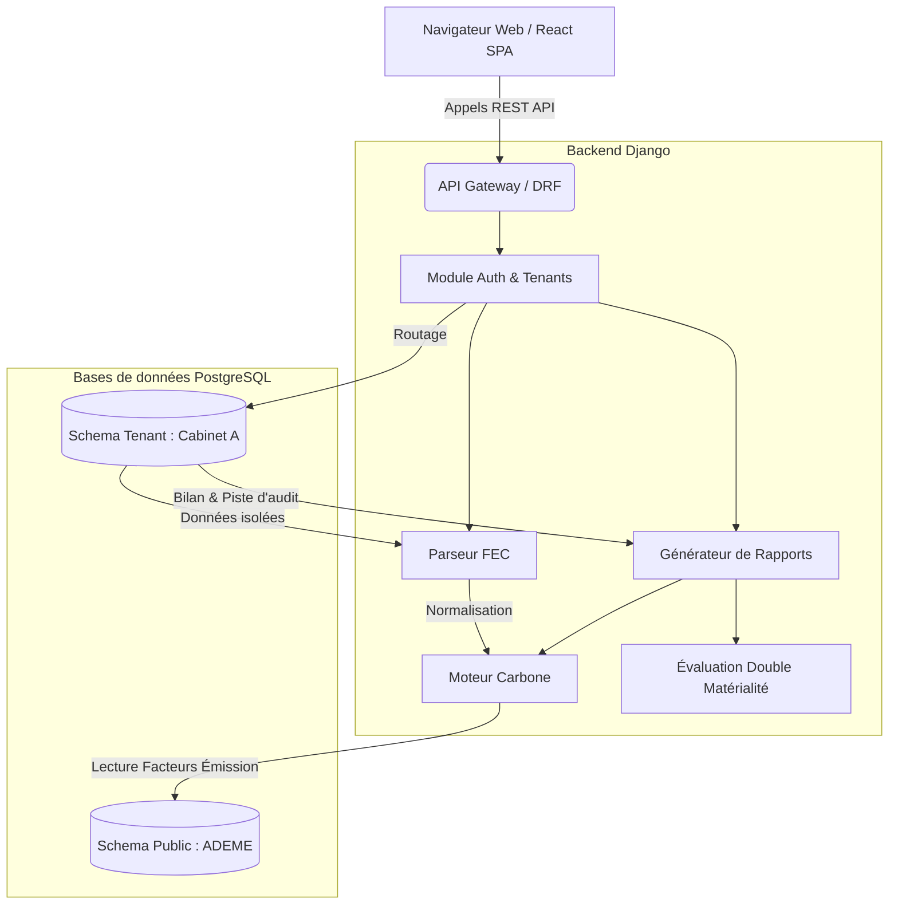
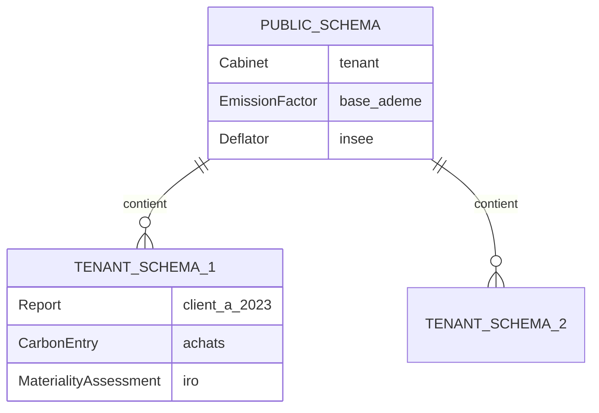

<div align="center">
  
  
  
  

  <br />
  <br />

  <h1>🌱 Générateur Carbone (SaaS Multi-Tenant)</h1>
  
  <p>
    <strong>Une solution automatisée permettant aux cabinets d'expertise comptable de générer les bilans carbones de leurs clients à partir du Fichier des Écritures Comptables (FEC).</strong>
  </p>
</div>

---

## 📖 Sommaire
- [À propos du projet](#-à-propos-du-projet)
- [Architecture du Système](#-architecture-du-système)
- [Modèle Multi-Tenant (Isolation des données)](#-modèle-multi-tenant-isolation-des-données)
- [Fonctionnalités Principales](#-fonctionnalités-principales)
- [Stack Technique](#-stack-technique)
- [Guide d'Installation](#-guide-dinstallation)

---

## 🎯 À propos du projet

Le **Générateur Carbone** transforme la comptabilité classique en comptabilité carbone. Conçu spécifiquement pour les experts-comptables, il automatise l'analyse des Fichiers d'Écritures Comptables (FEC), la catégorisation des achats, et leur conversion en équivalent CO₂ (Scope 1, 2 et 3) via la base Empreinte® de l'ADEME.

---

## 🏗 Architecture du Système

Le projet est divisé en deux parties majeures communiquant via une API REST. Le moteur de calcul carbone (`carbon_engine`) traite les lignes comptables, tandis que le parseur (`fec_parser`) ingère et normalise les fichiers.



---

## 🔐 Modèle Multi-Tenant (Isolation des données)

La sécurité et la confidentialité financière sont au cœur de l'application. L'architecture s'appuie sur le concept de **Multi-Tenancy par schémas PostgreSQL** via `django-tenants`.

- **Schema Public (`public`)** : Contient les données partagées par tous. 
  - *Exemples : Méta-données des cabinets, Facteurs d'émissions de l'ADEME, Déflateurs INSEE.*
- **Schemas Locataires (`cabinet_a`, `cabinet_b`)** : Chaque cabinet possède son propre schéma isolé au niveau de la base de données.
  - *Exemples : Fichiers FEC clients, Lignes comptables, Pistes d'audit, Évaluations IRO.*



---

## ✨ Fonctionnalités Principales

1. **Upload & Parsing FEC** : Ingestion normalisée des écritures comptables (txt, csv) avec validation des colonnes obligatoires.
2. **Sirétisation Automatique** : Enrichissement des données fournisseurs via l'API Sirene pour affiner la qualification sectorielle (NAF).
3. **Moteur de Calcul CO₂ (Ratio Monétaire & Physique)** : 
   - Application des ratios monétaires de la Base Carbone ajustés de l'inflation (déflateurs INSEE).
   - Possibilité de correction via des unités physiques.
4. **Piste d'Audit Fiable** : Historisation immuable (`ReportAuditTrail`) permettant aux Commissaires aux Comptes (CAC) de retracer l'origine de chaque kg de CO₂ calculé.
5. **Questionnaire Double Matérialité (IRO)** : Module d'évaluation des Impacts, Risques et Opportunités CSRD (Scopes ESG).

---

## 💻 Stack Technique

### Backend (API)
- **Framework:** Django 5.x, Django REST Framework
- **Base de données:** PostgreSQL (avec support JSONB et Trigramme)
- **Multi-Tenancy:** django-tenants
- **Tests:** Pytest
- **Traitement de données:** Pandas / NumPy (pour l'analyse de gros fichiers FEC)

### Frontend (SPA)
- **Framework:** React 18, TypeScript, Vite
- **Routage:** React Router DOM
- **Design & UI:** Tailwind CSS, Recharts (pour la data visualisation)
- **Gestion d'état & Fetch:** Hooks natifs & API Fetch customisée avec rafraichissement de tokens JWT.

---

## 🚀 Guide d'Installation

### 1. Prérequis
- Python 3.11+
- Node.js 18+
- PostgreSQL 14+ (L'extension `pg_trgm` doit être activée)

### 2. Installation Backend
```bash
cd src
# Création de l'environnement virtuel
python -m venv venv
.\venv\Scripts\activate  # Windows
# source venv/bin/activate # Linux/Mac

# Installation des dépendances
pip install -r requirements.txt

# Création des schémas et migrations
python manage.py migrate_schemas --shared
python manage.py migrate_schemas --tenant

# Lancement du serveur de développement
python manage.py runserver
```

### 3. Installation Frontend
```bash
cd frontend

# Installation des paquets npm
npm install

# Lancement du serveur Vite
npm run dev
```

L'application sera accessible sur `http://localhost:5173`. L'API écoute sur `http://localhost:8000/api/v1/`.

---

<div align="center">
  <i>Développé avec ❤️ pour la transition écologique.</i>
</div>
